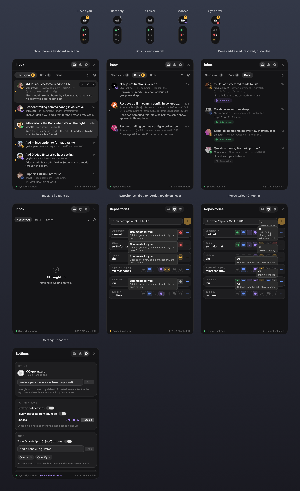

# Lookout

An always-on GitHub sidekick for macOS: a small pill docked to the edge of the screen, with an inbox for the events you care about.

**What it's for**

- **Your repos:** get notified on everything: new issues, new PRs, every comment.
- **Repos you contribute to:** only what's meant for you: replies on your issues and PRs, @mentions, answers after you comment, and review comments in your threads.
- **CI:** see at a glance which repos are green, red or running on main, and get pinged when main breaks.
- **Review requests:** from any repo, cleared once you've reviewed.

Bots are kept quiet, and items mark themselves *addressed* when you reply and *resolved* when a review thread is resolved.

## Install

Grab the latest zip from [Releases](https://github.com/0xpolarzero/lookout/releases), move **Lookout.app** to `/Applications`, then clear the quarantine once (the app isn't notarized yet):

    xattr -dr com.apple.quarantine /Applications/Lookout.app

## Build & run

    ./scripts/build-app.sh && open build/Lookout.app

Requires macOS 14+. Auth comes from `gh auth token` (or a token pasted in Settings, stored in the Keychain).

## Using it

- **Pill**: inbox (amber badge = unread items that need you, grey dot = only bots; a purple moon means snoozed, a red mark means a sync error), and CI counts: how many repos are passing (green), failing (red) and running (amber) on main; hover a row to see which, click to open the CI tab. Settings are in the panel. Drag it from anywhere to move it; it snaps to the nearest edge. `⌃⌥Space` toggles the panel.
- **Repositories**: add `owner/repo` (suggestions come from repos you own or are involved in) and toggle: issues, issue comments, PRs, PR comments, review comments, CI on the default branch.
- **Which comments count**: by default only comments that are for you: on issues/PRs you opened, ones that @mention you, or ones posted after you joined the conversation (for review comments: in a review thread you posted in). Turn on **All comments** per repo to get every comment.
- **CI**: the default branch of every repo with its CI badge on, failing first, with the commit, its title and the failing checks. Click a row to open the commit's checks.
- **Inbox**: *Needs you* / *Bots* / *Done*. Hover a row to mark it read, discard it, or open it. Keys: ↑↓ to move, Return to open, Space to toggle read, ⌫ to discard or restore, Esc to close.
- **States**: unread → read (you saw it) → **addressed** (you replied after it, so this happens automatically) → **resolved** (review thread resolved, synced through GraphQL). Discarded items go to Done.
- **Bots**: GitHub Apps (`…[bot]`) plus any handles you add arrive silently in the Bots tab.
- **Extras**: review requests from any repo (closed automatically once you review), CI red/green transition notifications, snooze, launch at login.

## Releasing

Push a version tag; the `Release` workflow tests, builds a universal app and publishes `Lookout-<version>.zip` to GitHub Releases:

    git tag v0.2.0 && git push origin v0.2.0

## Dev flags

    .build/debug/Lookout --demo [busy|botsOnly|allClear|snoozed|error|empty] --open   # mock data, nothing saved
    .build/debug/Lookout --snapshot docs/screenshots                                 # render every state + gallery.png
    .build/debug/Lookout --check owner/repo [--days N] [--all]   # headless live sync, prints the inbox
    .build/debug/Lookout --check owner/repo --thread 123         # what Lookout knows about one thread
    swift test

State: `~/Library/Application Support/Lookout/state.json`.
