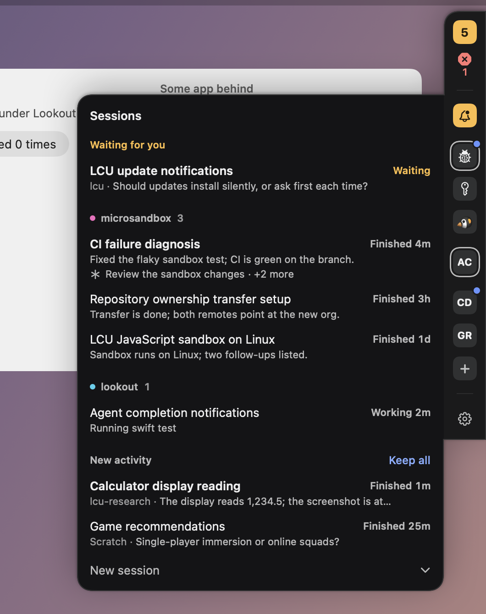
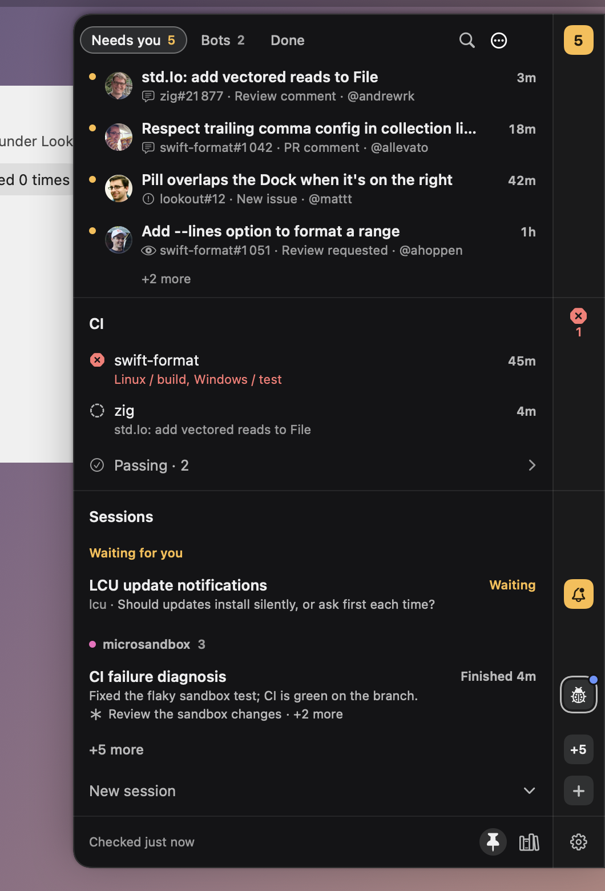

# Lookout

An always-on GitHub sidekick for macOS: a slim bar against the edge of the screen that opens, on hover, into an inbox for the events you care about, your CI and your Claude sessions.

**What it's for**

- **Your repos:** get notified on everything: new issues, new PRs, every comment.
- **Repos you contribute to:** only what's meant for you: replies on your issues and PRs, @mentions, answers after you comment, and review comments in your threads.
- **CI:** see at a glance which repos are green, red or running on main, and get pinged when main breaks.
- **Review requests:** from any repo, cleared once you've reviewed.

Bots are kept quiet, and items mark themselves *addressed* when you reply and *resolved* when a review thread is resolved.

 

## Install

Grab the latest zip from [Releases](https://github.com/0xpolarzero/lookout/releases), move **Lookout.app** to `/Applications`, then clear the quarantine once (the app isn't notarized yet):

    xattr -dr com.apple.quarantine /Applications/Lookout.app

After that Lookout updates itself: it checks in the background (shortly after launch, every hour and on wake), downloads and verifies a new release, then shows a green restart tile on the bar; hover it for what it is, click to restart into the new version. Right-click it for the release notes or to skip that version. Settings → General shows your version, checks on demand and turns the background check off. An update is only installed if its checksum matches and it's signed by the same certificate as the app you're running.

## Build & run

    ./scripts/build-app.sh && open build/Lookout.app

Requires macOS 14+. Auth comes from `gh auth token` (or a token pasted in Settings, stored in the Keychain).

## Using it

- **The bar**: flush against a screen edge (drag it to any edge of any screen; along the top or bottom it lays out horizontally), with the same cells in the same order on every edge: the inbox, CI, your Claude sessions, an update when there is one, and a gear. The inbox is an amber tile with its count when something needs you, a quiet tray otherwise. CI is one glyph for the worst state: a red octagon with how many repos are failing, a dashed circle while something runs, a quiet check when everything passes (absent when no repo has CI on). The gear opens Settings and wears a badge when syncing has a problem: red when you're signed out, amber for the rest. Nothing in the bar moves, changes size or dims on hover.
- **Peeks**: hover a cell for its panel, attached to the bar and level with the cell: the inbox, CI, the sessions, or, from the gear, the controls (Keep open, Repositories, Settings, when it last checked). A peek is whole rows and, if there are more, one *+N more* that keeps Lookout open on that section; it never scrolls.
- **Kept open**: `⌃⌥L` (customizable in Settings → Shortcuts; a lone modifier tap like right ⌘ works too) keeps the whole view open with the keyboard: inbox, CI and sessions at once, and a footer with when it last checked, Keep open and Repositories. Click a section's header (or ⌘1, ⌘2, ⌘3) to give it all the room, ⌘0 or Esc to bring the others back; a list that doesn't fit scrolls and says how many rows are below. The bar's cells slide beside their sections, but the one you aimed at doesn't move. Settings and Repositories slide in from the gear, with *Done* (or Esc) to leave. Right-click the bar for Keep Open, Settings, Repositories, Check for Updates and Quit.
- **Inbox**: *Needs you* / *Bots* / *Done*. A row is the title and age, then the kind, `repo#n` and author; unread is bold with a dot. Hover or pick a row for its one action, **Done** (or **Restore** in Done); click it to open it on GitHub. Right-click for read/unread, copy link and *Treat @author as a bot*. The menu beside the search icon has *Mark all as read* and *Done: all read* (*Clear Done* in Done). Done, Done all, Hide, Mute and Stop watching offer an Undo line for a few seconds and ⌘Z for 30; Done is ordered by when you cleared it. ⌘F, or just typing, searches the inbox and your sessions together.
- **CI**: every repo with its CI switch on. Failing and running repos are rows (failing first, then the latest change) with how long ago it changed and the names of the checks that failed, or the commit's headline; everything passing is one *Passing · 11* row that opens in place (click, or →/←). Click a repo to open its checks. Right-click for its commit, repository, *Check now*, **Mute until it changes** and *Stop showing CI*: a muted repo leaves the bar's glyph and count, waits under Passing, and is heard again when its commit or state changes.
- **Claude sessions (extension, off by default)**: for people using the Claude desktop app's Code tab. Turn it on in Settings → Claude. Your Claude Code sessions are tiles on the bar, and rows in the list in groups: **Waiting for you** first (every session stopped on a question or a plan, whichever project; its row says which), one group per project (**Scratch** for chats without a folder), then **New activity**. A tile shows its state as a shape: solid amber when it waits for you, a ring breathing round it while it works, a blue dot on its corner when it finished and you haven't looked. A session whose turn is over but that left subagents or shell commands running keeps the ring: its row says *Finished 4m*, names the first one and how many more. A row says its status and age, then the question it is stopped on or its last summary. New activity arrives unkept: **Keep** the ones you use (*Keep all* for every one), or **Hide** them until their next activity. The bar shows eight tiles and a *+N* for the rest (amber when one of them waits, and waiting sessions are never left out); the *+* starts a new session, a scratch chat or a project by name. The header says *1 waiting* when the section is folded to it. One tile per session: two letters (or an emoji you pick), projects grouped together; right-click for the project's colour, to mute it, move a session up or down in its project (⌥↑ ⌥↓, or drag), or change its label. Optionally, each session gets an SF Symbol picked for it instead: paste a [TypeSafe](https://typesafe.ai) API key in Settings → Claude and Jev picks one from the title, project and first message (first the kind of icon, then one of ~680 SF Symbols in it that isn't already on screen; about $0.0002 a session; the key stays in the Keychain). Click a session to jump to the conversation. `⌃⌥S` opens Lookout on your sessions from anywhere: ↑↓ and Return to open, or just type to find any session by name; ⌘K keeps, ⌘⌫ hides, Esc goes back. Read state follows the app (a finished turn, opening a session, the sidebar's dot) and can be changed in Lookout without touching the app. Lookout only reads the app's files (`~/Library/Application Support/Claude`, `~/.claude/projects` for what a working agent is doing, and Claude Code's task list in `/private/tmp/claude-<uid>` for what's left running in the background; a shell command counts as running for as long as its process has its output open), which aren't a public API: if an app update changes them, Lookout says so and the GitHub side keeps working.
- **Repositories**: add `owner/repo` or a GitHub URL (suggestions come from repos you own or are involved in; Return adds). Each repo says what it tells you about, in a pop-up: *Everything* (new issues and PRs and every comment), *Only what's for me* (comments, and only the ones for you) or *Custom*, which lists a checkbox each for issues opened, issue comments, PRs opened, PR comments and review comments, and for every comment; and has a CI switch for the default branch. A new repo starts as Custom, with the comments for you and CI on. One that can't be reached says why in a line of its own, with *Retry*. Drag to reorder (or ⌥↑ ⌥↓); right-click to open it, its Actions or its latest checks, or stop watching. A change of preset or a stopped repo can be undone.
- **Which comments count**: by default only comments that are for you: on issues/PRs you opened, ones that @mention you, or ones posted after you joined the conversation (for review comments: in a review thread you posted in). *Everything*, or **Every comment, not only the ones for me** in Custom, gets every comment.
- **Settings**: *General* (your account, Repositories, how often to check, Launch at login, keeping the bar centred, updates, Quit), *Notifications* (desktop notifications, review requests, snooze, the bots), *Shortcuts* and *Claude*. Arrows switch panes.
- **Keys**: kept open, keys act on the row under the pointer, or the one you picked with ↑↓: Return opens, Space toggles read, ⌫ is Done or Restore, ⌥Space marks all read, ⌘R checks now, ⌘Z undoes, ⌘, opens Settings, Esc steps back (menu, search, page, section, then closes). Tab walks a ring through the buttons; a focused button keeps Space and Return. Every button's tooltip shows its key; the ones that act on a row, and Keep open, are customizable in Settings → Shortcuts.
- **States**: unread → read (you saw it) → **addressed** (you replied after it, so this happens automatically) → **resolved** (review thread resolved, synced through GraphQL). Done items go to the Done tab and can be restored.
- **When something's wrong** it says what, once: a sign-in problem replaces the inbox with how to fix it, repos that didn't sync, GitHub rate limiting and snooze are a banner above the list, and *All caught up* only shows when every source was checked.
- **Bots**: GitHub Apps (`…[bot]`) plus any handles you add arrive silently in the Bots tab.
- **Accessibility**: every cell and row works with VoiceOver (actions for everything a hover button does, announcements for Done, undo and search results), the keyboard and Full Keyboard Access; Increase Contrast, Differentiate Without Colour and Reduce Motion are followed. Lookout is dark only, on purpose.
- **Extras**: review requests from any repo (closed automatically once you review), CI red/green transition notifications, snooze, launch at login.

## Releasing

Push a version tag; the `Release` workflow tests, builds a universal app and publishes `Lookout-<version>.zip` to GitHub Releases:

    git tag v0.2.0 && git push origin v0.2.0

Releases are signed with one self-signed certificate, so macOS keeps Lookout's Accessibility access across updates and the updater can check a release is ours. Set it up once:

1. In Keychain Access: Certificate Assistant → Create a Certificate, name **Lookout Dev**, identity type *Self-Signed Root*, certificate type *Code Signing*.
2. Export it with its private key as a `.p12` (with a password), then add two repository secrets: `SIGNING_CERT_P12` (`base64 -i cert.p12 | pbcopy`) and `SIGNING_CERT_PASSWORD`.
3. Keep the `.p12` safe: a release signed with another certificate isn't installed by existing apps, and everyone has to update by hand once.

`build-app.sh` signs local builds with the same certificate when it's in your keychain (ad hoc otherwise, which macOS treats as a new app on every build).

## Dev flags

    .build/debug/Lookout --demo [busy|botsOnly|allClear|snoozed|error|empty|agents|…] --open   # mock data, nothing saved
    .build/debug/Lookout --claude [--watch]                      # what the Claude extension reads; --watch prints live changes
    .build/debug/Lookout --playground                            # the bar on a fake desktop, demo data, every edge
    .build/debug/Lookout --playground-shots <dir> [filter…]      # render the bar's states as PNGs, all or those whose name has a filter
    build/Lookout.app/Contents/MacOS/Lookout --update 0.1.0   # pretend to be 0.1.0: check, download and verify the latest release
    .build/debug/Lookout --check owner/repo [--days N] [--all]   # headless live sync, prints the inbox
    .build/debug/Lookout --check owner/repo --thread 123         # what Lookout knows about one thread
    swift test
    scripts/design-lint.sh                                       # forbidden constructs, retired words, stray hues
    scripts/idle-cpu.sh                                          # release build at rest and kept open: under 0.1% CPU

State: `~/Library/Application Support/Lookout/state.json`. The design is in [DESIGN.md](DESIGN.md).
